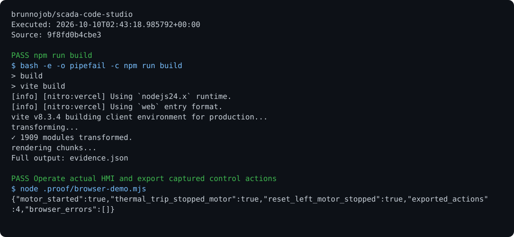

# SCADA Code Studio

An interactive interface for electrical controls, ladder diagrams, and motor states, with accessible controls and action-history export.

## Run

Requirements: React, TypeScript, TanStack Start, and Vite.

```sh
npm ci
npm run dev
npm run build
```

## Behavior

Controls handle pointer input, cancellation, keyboard interaction, and loss of focus. History retains up to 1,000 actions and exports JSON for the operations archive. This is a training environment and does not control a physical PLC.

## Optional report archive

Use the [shared operations archive client](https://github.com/brunnojob/vercel-home-telemetry-api/tree/main/cloud) to queue `result.json` under project `scada-code-studio`. The client uses `BRUNNODEV_ACCESS_TOKEN` and retains unacknowledged reports locally.

## License

Original source and documentation are MIT licensed; see [LICENSE](LICENSE). Third-party dependencies and media retain their respective terms. Maintained by [Brunno Dev](https://brunnodev.store).

## Implementation update

Netlify builds use the official TanStack Start adapter with SSR output; the previous Nitro target remains available outside Netlify. Session recording validates action fields and exports only bounded, known fields. Use `NETLIFY=true npm run build` to verify the Netlify target locally.

Contribution trailer: `Co-authored-by: nyctophile <329826984+ineedfoundmyway@users.noreply.github.com>`.

## Execution proof

[](https://github.com/brunnojob/scada-code-studio/actions/workflows/proof.yml)



[Verified run](https://github.com/brunnojob/scada-code-studio/actions/runs/38017502576) · [Execution report](docs/proof/evidence.json)

Run `python .proof/record.py` after installing the prerequisites above. The scenarios execute repository code and verify exit codes and expected output. CI publishes `execution-proof` with the transcript, input fingerprints and source commit. The downloadable report identifies the exact tested version; the workflow badge tracks the latest run.
